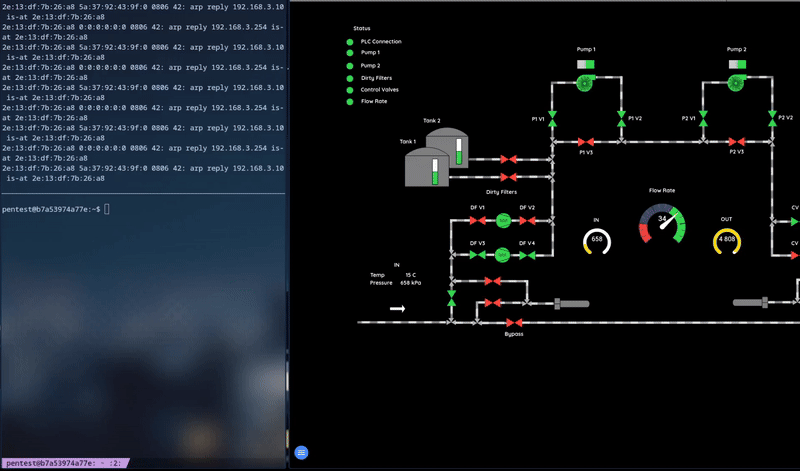

# Modbus MITM 

A simple **Modbus TCP Man-in-the-Middle (MITM)** written in Python 3, based on PyModbus 3.x.

This script allows you to intercept incoming Modbus coil requests, manipulate them (e.g., set all to 0), and forward the modified values to the real PLC. It is intended for penetration testing, demonstrations, and security research.



> ⚠️ Use only in controlled test environments! Do not run on production systems.

---

## Features

- TCP Modbus server on any port (default test port: 502)  
- Manipulates all incoming coils to 0  
- Asynchronous forwarding to the real PLC  
- Dynamic target IP input  
- Compatible with PyModbus 3.x and Python 3.10+  

---

## Requirements

- Python 3.10 or higher  
- PyModbus 3.x  
- `asyncio` (built into Python standard library)

Install dependencies:

```bash
pip install pymodbus
